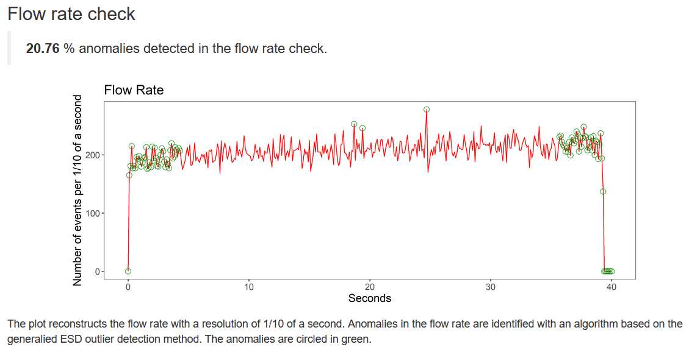
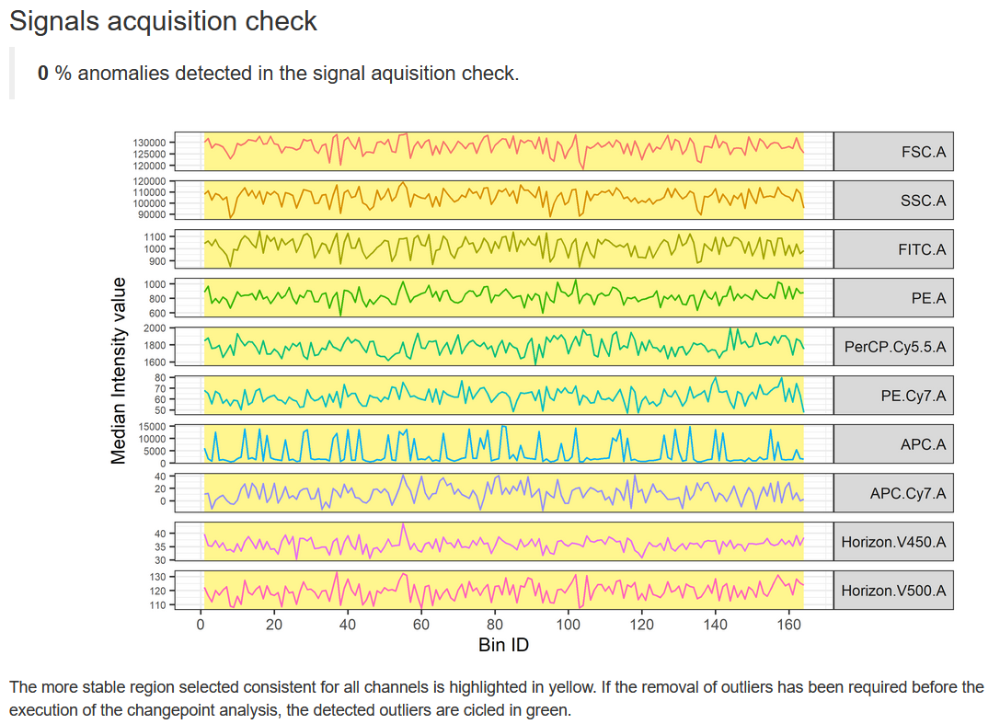
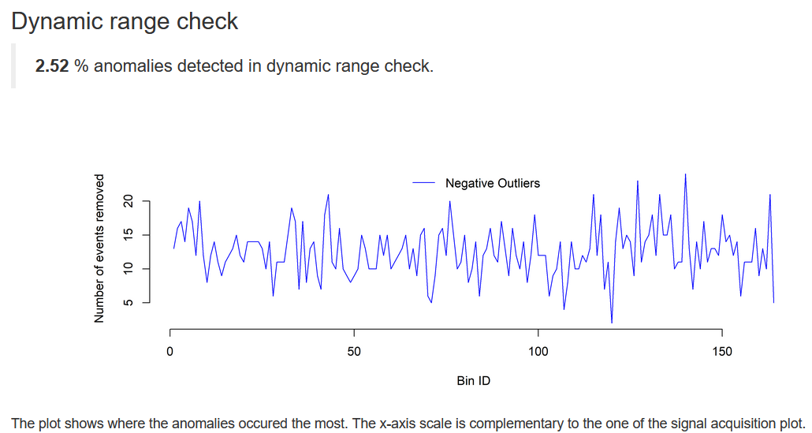
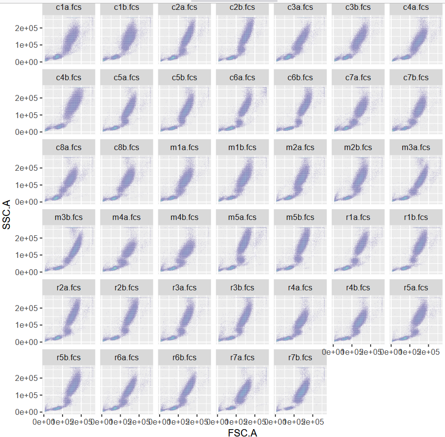
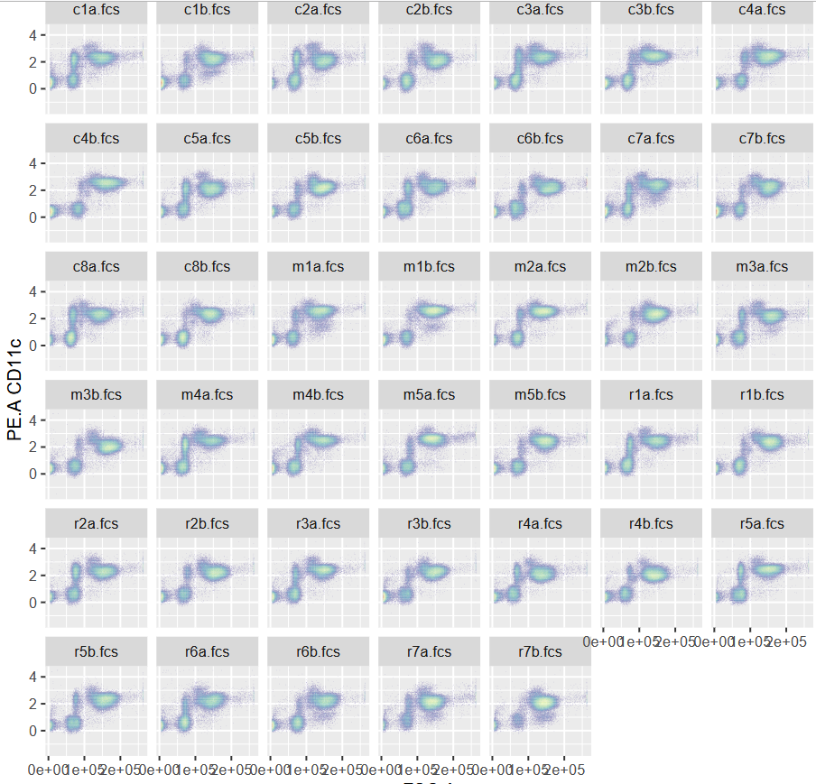
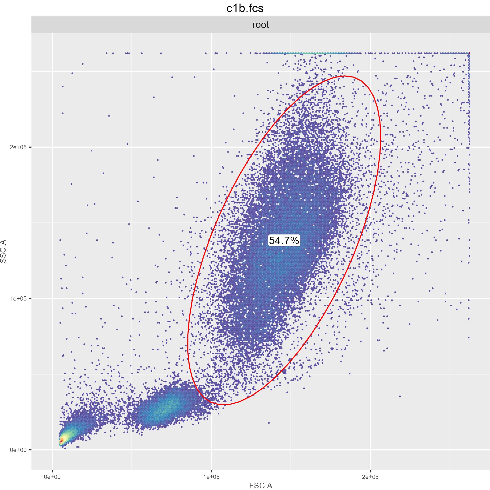
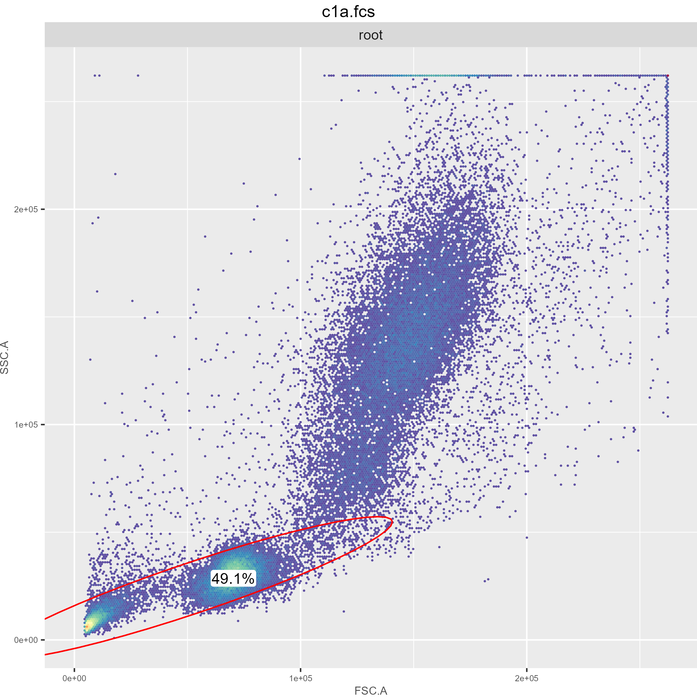
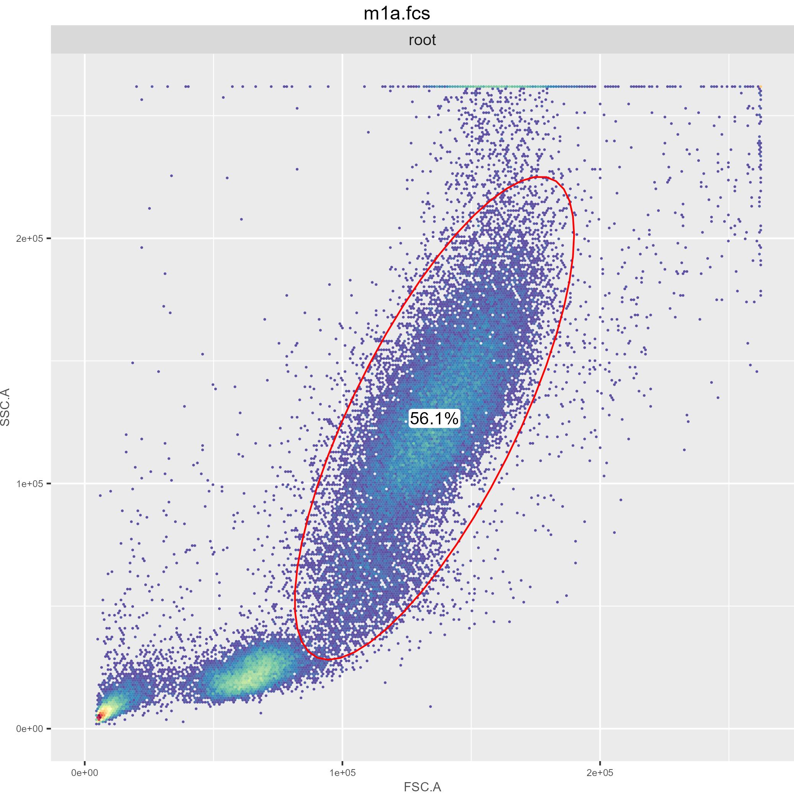
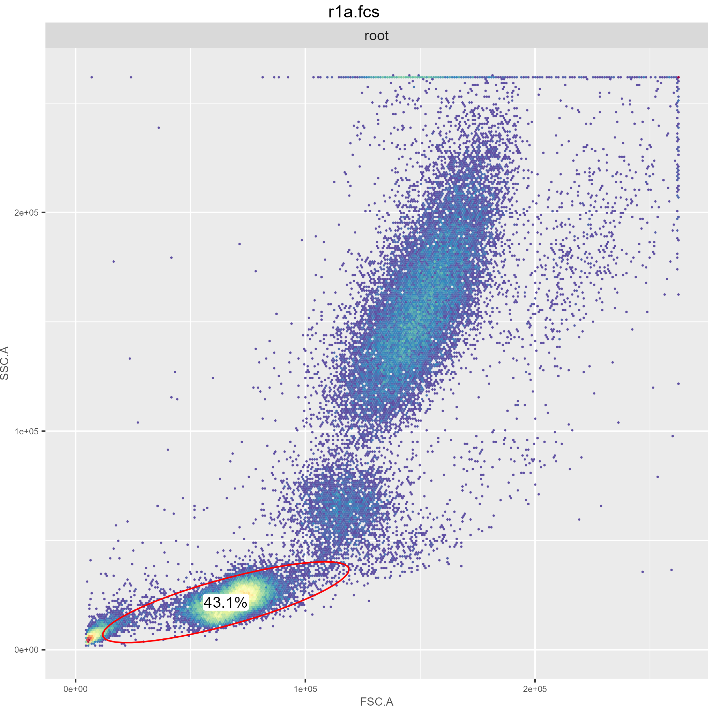

Flow cytometry project using Rstudio

Dataset: Experiment name "Mobilization of cells through acute exercise in metabolic syndrome patients" from flowrepository.org 

#conpensate data (essential step in the analysis of multicolor panels --> corrects for the overlap of fluorescent signals between different channels)

#Quality check (Flow Rate Check , Signal Acquisition Check, Dynamic Range Check)

#Transformation (convert skewed data into a more normally distributed form)

#Visulaize the results using ggcyto

#Gating (Cell Population Identification, Noise Reduction, Analysis Simplification, Quantitative Analysis,Sequential Gating)

#statistics

